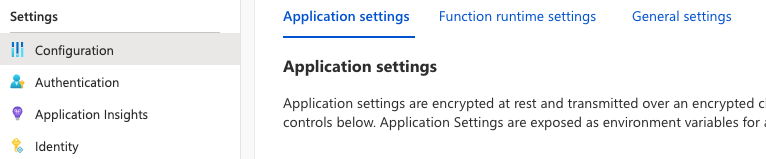
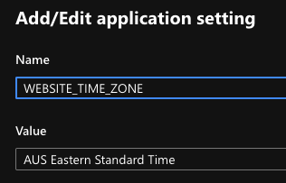
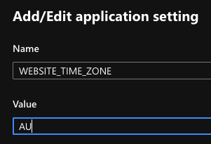

By default, the timezone of an Azure Function app is UTC/GMT +0 or Greenwich Mean Time. This is great if that is your timezone or the timezone you want your application functions to run in, but for most of us, we need to either adjust all our schedules to fit that timezone or we need to change the timezone.

Luckily, the solution is actually pretty simple. It doesn't even involve coding anything.

## Changing the Timezone

All function apps have a set of configuration settings that can be applied in the settings through the portal:

One of these settings is WEBSITE_TIME_ZONE, which as the name suggests, allows us to define the timezone of the web application that runs behind the scenes of all Azure Function apps.

Azure provides us two options when creating a function app:

1. We can create a Windows-based function app, or,

2. We can create a Linux based function app

If you have or create a Windows app, all the available options for the timezone setting values can be found in the official [Microsoft Docs](https://docs.microsoft.com/en-us/previous-versions/windows/it-pro/windows-vista/cc749073(v=ws.10)).

For Linux, we need to fall back to the Linux database timezone information provided in Wikipedia, which can be found [here](https://en.wikipedia.org/wiki/List_of_tz_database_time_zones).

So, for me, as I am East-Coast Australia based, I would configure my apps:

For Windows -

And for Linux -

## Testing

The easiest way to test & confirm that the timezone has taken effect after saving is to leave the default log statement that a new function comes with:

context.log('HTTP trigger function processed a request.');

This will appear in the logs with a timestamp. You will be able to confirm that the date & time displayed matches that of the configured timezone.

## Testing Locally

If you need or want to test your functions in different timezones from your lcoal machine setting, the Azure Functions local.settings.json also interprets the same configuration setting.

This means you can add

"WEBSITE_TIME_ZONE" : "GB" (for Linux)

to your local.settings.json file. When you execute your functions locally, the timezone applied to the date-time objects in your code will apply the Great Britain timezone.