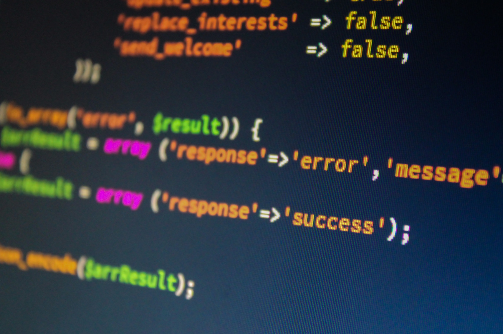

### NodeJs Environment Variables

Environment variables in NodeJs are essential for setting configuration options as well as storing important values securely. NodeJs by default comes with some environment variables that describe various parts of the application and the infrastructure it is being run on.

These variables, along with any custom added ones are available inside the process.env object that can be accessed in any script file within the app.

The environment variables allow you to store API keys and other configuration secrets independently from your main codebase and separate from your git repository so they never get checked in anywhere. 

Being able to configure and consume these variables is essential in creating solid, production-ready NodeJs APIs for all applications.

Fortunately, there are npm packages that can help us as well as DevOps configurations.

### Using Dotenv

[Dotenv](https://github.com/motdotla/dotenv) is an npm package that can be added to any NodeJs application. The main purpose of the Dotenv package is to allow developers to create a .env file that has custom environment files that are added into the process.env object.