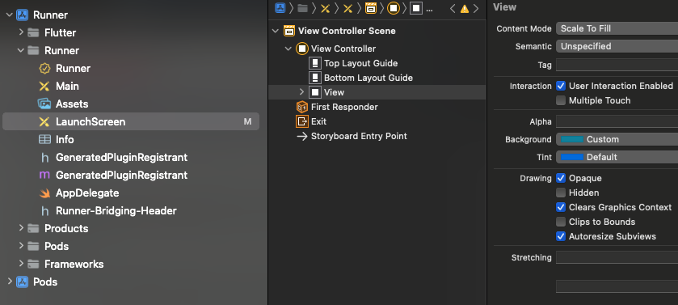

## Why is there a white screen before the splash?

By default, iOS and Android show a native loading screen before the splash screen of a Flutter app is displayed. This default screen is completely white which means your app will have a white "flash" before showing your custom splash screen in your app's colours and with your logo. This is not a good user experience. We are unable to remove this native screen, but we can customise it a little bit to make it less intrusive.

## Customising the white screen

The white screen is native to the platform (Android and iOS) so it can't be removed. Fortunately, both platforms provide the ability to set the background colour of this screen. This means that at a minimum, the white screen can be incorporated into the loading process of your app without sticking out like the plain white can.

### Android

For Android, we need to modify the styles.xml file found in android/app/src/res/values/styles.xml

There are two values here to be set - one for the white screen and the other for the time between hiding your custom splash screen and showing the first screen of your app. These settings allow values from the Drawable options as well as project variable values.

The styles.xml will end up looking something like:

```xml
<?xml version="1.0" encoding="utf-8"?>
<resources>
    <!-- Theme applied to the Android Window while the process is starting when the OS's Dark Mode setting is off -->
    <style name="LaunchTheme" parent="@android:style/Theme.Light.NoTitleBar">
        <!-- Show a splash screen on the activity. Automatically removed when
             Flutter draws its first frame -->
        <item name="android:windowBackground">@drawable/splash</item>
    </style>
    <!-- Theme applied to the Android Window as soon as the process has started.
         This theme determines the color of the Android Window while your
         Flutter UI initializes, as well as behind your Flutter UI while its
         running.
         
         This Theme is only used starting with V2 of Flutter's Android embedding. -->
    <style name="NormalTheme" parent="@android:style/Theme.Light.NoTitleBar">
        <item name="android:windowBackground">?android:colorBackground</item>
    </style>
</resources>

```

Finally, to finish the setup, in the AndroidManifest.xml file we need to add references in:

```xml
<application
  .....
  <activity
    android:name=".MainActivity"
    android:theme="@style/LaunchTheme"
    <!-- Specifies an Android theme to apply to this Activity as soon as
         the Android process has started. This theme is visible to the user
         while the Flutter UI initializes. After that, this theme continues
         to determine the Window background behind the Flutter UI. -->
    <meta-data
      android:name="io.flutter.embedding.android.NormalTheme"
      android:resource="@style/NormalTheme"
      />
    <!-- Displays an Android View that continues showing the launch screen
         Drawable until Flutter paints its first frame, then this splash
         screen fades out. A splash screen is useful to avoid any visual
         gap between the end of Android's launch screen and the painting of
         Flutter's first frame. -->
    <meta-data
      android:name="io.flutter.embedding.android.SplashScreenDrawable"
      android:resource="@drawable/splash"
      />
  </activity>
</application>
```

This will cover off all of the Android initialisation timings.

### iOS

The iOS solution is simpler and can be done in two places.

The first is directly in the storyboard file if you can't/don't work directly in XCode very often.

Open up LaunchScreen.storyboard found in ios/Runner/Base.Iproj. In this file, you will find one tag called <color> with a key of "backgroundColor" and attributes red, green, blue and alpha numbers. By default, they will all be set to 1. The other attributes are to be left as-is.

The trick with editing this file directly is that the values need to be decimals and so if you are working in standard RGB colour numbers, you need to divide them by 255 to get the equivalent decimal value.

For the last app I did this on, the color tag ended up being:

```xml
<color 
 key="backgroundColor" 
 red="0.019607843137254902" 
 green="0.55000000000000004" 
 blue="0.66000000000000003" 
 alpha="1" 
 colorSpace="custom" 
 customColorSpace="sRGB"
/>
```

The second method is via XCode.

Open up your Flutter app in XCode and navigate to the LaunchScreen ViewController View node:



On the right in the properties, there is the background attribute. Clicking on this and choosing custom will allow you to define the RGB value you'd like the colour of the white screen to now appear as.

Running your app on Android and iOS will now no longer show the annoying white screen.