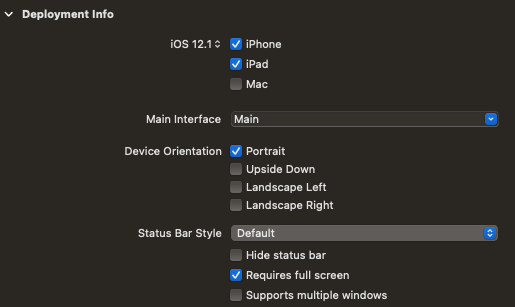

A quick tip here for new-to-XCode iOS developers.

If you want your iOS app to only display in portrait (or landscape) modes to users when they are using your app, there's a little trick to get it to apply to both iPhones and iPads.

It would appear obvious at first that this should work:

Select both device types and select portrait as the only option, but no, this does not work for iPads.

What you actually need to do is:

1. Uncheck the iPhone checkbox in the General → Deployment Info section
2. Ensure iPad is checked
3. Set Device Orientation checkbox for Portrait only true
4. Set the Requires full-screen checkbox to true
5. Build/Run the app to confirm

You'll most likely see after step 1 is completed that the orientation options defaults back to both portrait and one of the landscape options.